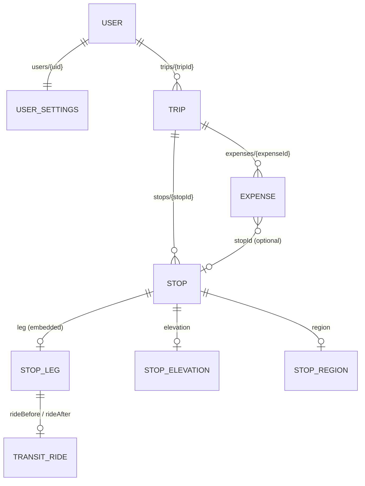
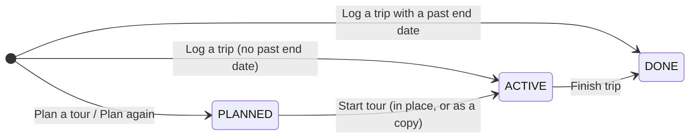
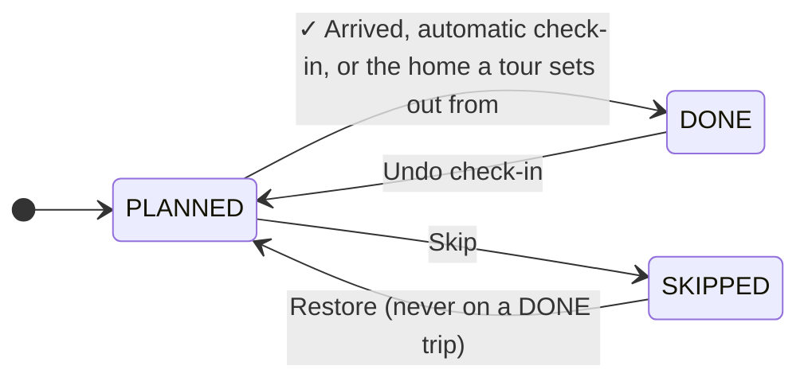

# Domain model

Models are Kotlin data classes in `data/model/Models.kt`. They are plain values: no
Firestore annotations, no Android types. `LatLng` is the app's own pair of doubles, so
the Maps SDK type never leaks past `ui/map`.



## Trip

| Field | Meaning |
| --- | --- |
| `name` | Only what the user typed. Blank is normal. |
| `startDate`, `endDate` | Trip dates. A PLANNED trip's `startDate` follows its first unskipped stop; `endDate` is set by "Finish trip" or by logging a past trip. |
| `status` | PLANNED → ACTIVE → DONE. Legacy documents without the field derive it from `endDate` and are never PLANNED. |
| `totalCost`, `nights` | Denormalized recorded totals, recomputed by the repository after every stop/expense write. **Recorded numbers only.** |
| `region` | Denormalized from the stops' regions ("Ticino & Graubünden"), recomputed with the totals. |
| `plannedCost`, `plannedNights` | Snapshot of the estimate taken when the tour was started, for planned-versus-actual. |
| `notes` | Free text. |

What a trip is *called* is `Trip.title` (`domain/TripName`): the name, else the region,
else a stable made-up name from the id ("Rusty Edelweiss"). Never stored.

## Stop

| Field | Meaning |
| --- | --- |
| `orderIndex` | Position in the trip. The timeline, the route and the date cascade all sort by it. |
| `kind` | CAMPSITE, STELLPLATZ, FREE_CAMP, VISIT, HOME. `StopKind.isStay` is true for the first three; everything nights- or price-related keys off it. |
| `state` | PLANNED, DONE (reached / checked in), SKIPPED (kept in the record, counts toward nothing, leaves the route). |
| `arrivalDate`, `arrivalTime` | The day, and the time of day stamped at check-in. Editing the date keeps the time. |
| `nights` | Zero for visits and home. |
| `campingCostTotal`, `costKnown` | The site fee for the whole stay. `costKnown = false` means "not priced yet, estimate at the kind's default rate". `true` with 0 means "free, known". Estimates are never written into `campingCostTotal`. |
| `name`, `notes` | The name comes from the picked place, a reverse geocode, or the kind as a last resort. |
| `location` | Nullable. A stop with no pin still has a date and a name. |
| `placeId`, `locationCachedAt` | Set only when the coordinate came from the Google Places API. `locationCachedAt` starts the 30-day retention clock; null means the coordinate is ours to keep (GPS, dropped pin, coordinate lifted from a shared link). |
| `leg` | The drive arriving here from the stop before, as routed. Null on the first stop and until fetched. |
| `elevation` | Height of the stop itself, with the coordinate it was measured for. |
| `region` | Canton/state and country, with the coordinate it was looked up for. |
| `track` | GPS fixes recorded while this stop was the heading. Appended atomically, never rewritten from a stale copy. |

### StopLeg and TransitRide

A `StopLeg` records `from`/`to` (the two coordinates it was routed between), the encoded
polyline, distance, duration, optional ascent/descent, optional rides either side, and
`fetchedAt`. Recording the endpoints is the invalidation mechanism: a moved pin or a
reorder makes the stored leg fail the `RouteCache.usable` comparison, so nothing has to
remember to clear it. A leg with `distanceMeters == 0` (`hasRoad == false`) is a stored
"no drivable route" answer, kept so the same question is not asked again for 30 days.

A `TransitRide` (park and ride) says where the vehicle is parked, the ride's polyline,
distance, duration and the `TravelMode`s boarded. The ride *up* to a stop sits on that
stop's leg as `rideAfter`; the ride *down* sits on the next stop's leg as `rideBefore`.

### Elevation and region carry their coordinate

`StopElevation.at` and `StopRegion.at` are compared with `Stop.location` on read. A
moved pin invalidates both by comparison, the same trick as the leg.

## Expense

| Field | Meaning |
| --- | --- |
| `type` | CAMPING (extra site fees only, the stay's fee is on the stop), FUEL, ROAD_TAX, OTHER. |
| `amount`, `date`, `label` | In the app currency. Vignette labels start with the country code, which is how duplicates are detected. |
| `stopId` | Optional link to a stop. Dropped when a trip is copied. |
| `isEstimate` | Created by the fuel estimator sheet or a vignette suggestion. Copied into a new plan; real expenses are not. |

## UserSettings

One document per user: `currency` (CHF), `fuelConsumptionL100km` (10), `fuelPricePerLiter`
(1.80), `roadDistanceFactor` (1.25), `vehicleMassKg` (3500), `homeName`/`homeLocation`,
`campsitePerNight` (45), `stellplatzPerNight` (15). Defaults live on the class and are
what a missing Firestore field deserializes to.

## Lifecycles





"Tonight's stop" and "the stop you are heading for" are derived, not stored
(`domain/CurrentStop`): the last DONE stop while its nights are not over is *current*;
otherwise the first PLANNED stop past the check-in line is both current and the
*heading*. A checked-in zero-night stop (home, a visit) is behind you at once.

## Derived, never stored

| Derived value | From | Where |
| --- | --- | --- |
| `Trip.title` | name, region, id | `domain/TripName` |
| Timeline rows incl. gap rows | stops' dates and order | `domain/Timeline` |
| Estimates (≈ totals) | stops, expenses, settings | `domain/TripEstimator`, `domain/FuelEstimator` |
| Current stop, heading | stops, today | `domain/CurrentStop` |
| Distance from here | last GPS fix | `domain/RouteTracker` state |
| Map markers, routes, camera | trips and stops | `domain/MapOverlay` |
| Vignette suggestions | stops, expenses | `domain/CountryGuess`, `domain/VignetteTable` |

## Invariants the repositories keep

Both `InMemoryTripRepository` and `FirestoreTripRepository` run the same three steps
after every stop write (and the first after every expense write):

1. **`recomputeTotals`** — `Trip.totalCost`, `nights` and `region` from the current
   stops and expenses (`CostCalculator`, `TripName.region`). Any new mutation path must
   call it or the trip list shows stale totals.
2. **`redatePlan`** — `DateCascade.settle`: no PLANNED stop may arrive before the stop
   in front of it leaves; the rest of the plan keeps its spacing. A DONE stop's planned
   departure binds nothing (tours leave early). Then a PLANNED trip's `startDate`
   follows its first unskipped stop. Skipped on DONE trips: a finished trip is a record.
3. **`settleTracks`** — `Tracks.settle`: fixes belong to the drive underway, whichever
   stop it now arrives at (a stop inserted in front takes them over).

Because the plan is settled after *every* write, **a stop change and the shift it causes
must land in one `upsertStops` call**. Two writes would be settled twice, and a lost
second write could leave the plan overlapping.

## Time

Days are `LocalDate`, the arrival time is `LocalTime`, and "today" is the device's local
date. Check-in dwell uses `ZonedDateTime` so a night the clocks change counts real
minutes. Firestore stores dates as epoch-day longs and times as second-of-day longs.

## Firestore layout

```
users/{uid}                       UserSettings fields
users/{uid}/trips/{tripId}        Trip fields
users/{uid}/trips/{tripId}/stops/{stopId}
users/{uid}/trips/{tripId}/expenses/{expenseId}
```

Security rules grant a user read/write under their own `users/{uid}` subtree only.
Because rules are path-scoped, collection-group queries are rejected; cross-trip reads
combine one listener per trip instead. The `stops.track` field has an index exemption
(`firestore.indexes.json`) so Firestore does not index every GPS fix.

Mapping is manual in `FirestoreTripRepository` and `FirestoreSettingsRepository`:

| Kotlin | Firestore |
| --- | --- |
| `LocalDate` | epoch-day `Long` |
| `LocalTime` | second-of-day `Long` |
| `LatLng` | `GeoPoint` |
| enum | `name` string, `valueOf` with a fallback on read |
| `StopLeg`, `TransitRide`, `StopElevation`, `StopRegion` | nested map |
| `track` | array of `GeoPoint`, appended with `arrayUnion` |

There is no migration machinery: every reader tolerates a missing field by using the
model default, and a nested map missing its key fields (`from`/`to`, `at`, `parked`)
reads as null.
