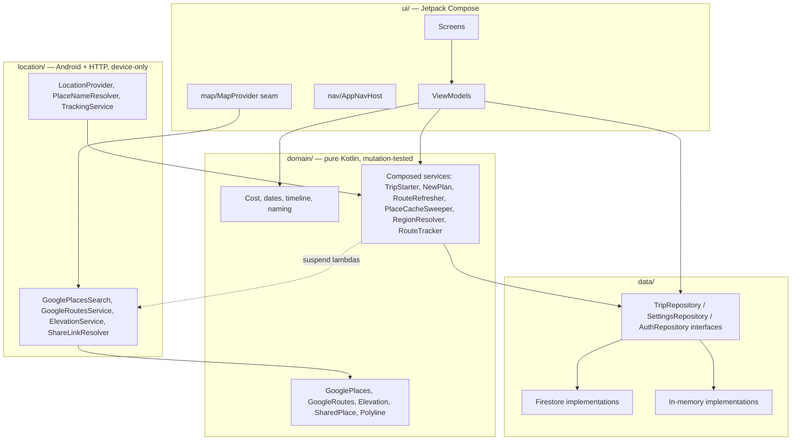
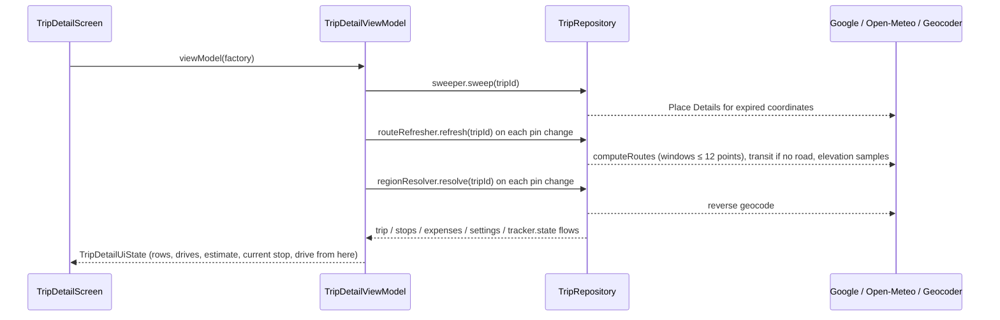
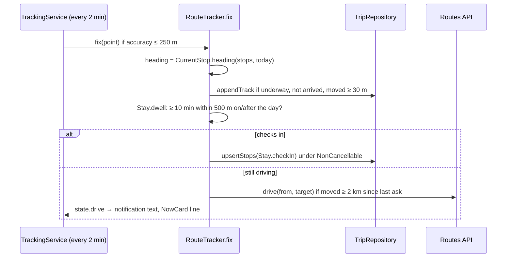

# Architecture

MVVM with a repository layer, hand-rolled dependency injection, one Gradle module.
Package root: `app/src/main/java/com/nuelto/etappli/`.

The dependency direction is strict: `domain/` knows only `data/model` and the repository
interfaces; it never imports Android, Firebase or Maps types. Network code in
`location/` is thin transport around request builders and parsers that live in
`domain/`, so the logic is testable on the JVM and the transport is excluded from
coverage.

## Package map

| Package | Contents |
| --- | --- |
| root | `CamperApp` (Application, `AppContainer`), `MainActivity` (auth gate, share intake, tracking trigger), `FirebaseBackend`, `MapsBackend` |
| `data/` | Repository interfaces, `InMemory*` and `Firestore*` implementations, `AuthRepository`, `model/Models.kt` |
| `domain/` | Everything that decides something. Pure objects plus services composed over the repository interface |
| `location/` | Play services location, platform Geocoder, foreground tracking service, `HttpURLConnection` clients for Places, Routes, Open-Meteo and short links |
| `ui/nav/` | Type-safe routes and the NavHost |
| `ui/triplist/`, `ui/tripdetail/`, `ui/tripedit/`, `ui/settings/`, `ui/share/`, `ui/auth/` | One screen and ViewModel per feature |
| `ui/map/` | `MapProvider` seam, Google implementation, `TripMap`, all-trips map, location picker, `LocationSection` |
| `ui/components/` | Fields (decimal, date), reorderable list, status badge, hand-drawn travel icons |
| `ui/theme/` | Material theme and the status colour language |
| `ui/Format.kt` | Every user-visible number and date string |

## Composition root

`CamperApp.onCreate` builds one `AppContainer`. Two independent switches decide what
goes in it:

| Switch | Decided by | Effect |
| --- | --- | --- |
| Store | `FirebaseApp.initializeApp()` non-null (google-services.json baked in at build time) | Firestore repositories + `FirebaseAuthRepository`, else in-memory repositories with seeded demo data and no auth |
| Map | `mapsApiKey` present and Play services available (`MapsBackend`) | `GoogleMapProvider`, else `PlaceholderMapProvider` (no map, no search, no routing) |

The container also holds the one-shot GPS lambda, the short-link expander, the
`ShareIntake` slot, the single `RouteTracker`, and a `startTracking` lambda that starts
the foreground service. Tests build `AppContainer.inMemory(...)` with fakes.

ViewModels never see the container. Each has a companion `Factory =
containerViewModelFactory { container -> ... }` that picks what it needs, so
constructors take interfaces and lambdas and are trivial to construct in tests.
There is no Hilt or Room: the object graph is a dozen lines and a DI framework would
cost more in build time and indirection than it saves.

## Auth gate and app root

`MainActivity.AppRoot` renders the NavHost only when there is no `AuthRepository`
(local mode) or a user is signed in; otherwise it shows `SignInScreen`. Every ViewModel
may therefore assume a signed-in user in Firebase mode. The gate is in the root, not in
navigation, so a shared place arriving while signed out waits in `ShareIntake` on the
container and is routed once a NavHost exists.

`TrackingTrigger` (also in `AppRoot`) starts the tracking service whenever the app is in
the foreground with a drive underway; it re-asks on every return to STARTED because
the system may have ended the service.

## Repositories

`TripRepository` exposes flows (`trips()`, `trip(id)`, `stops(tripId)`,
`expenses(tripId)`, `allStops()`, `allExpenses()`) and suspend writes (`upsertTrip`,
`upsertStop(s)`, `deleteStop`, `appendTrack`, `upsertExpense`, ...).

- **Reads are hot.** Firestore reads are snapshot-listener `callbackFlow`s, so every
  screen updates live and offline from the local cache. Cross-trip flows combine one
  listener per trip because collection-group queries are rejected by the rules.
- **Writes are fire-and-forget.** `set`/`update`/`delete` are never awaited: with
  offline persistence the task completes only on server ack, so awaiting would hang the
  UI without signal. Multi-stop writes go through one Firestore batch (`upsertStops`)
  so the local view never sees the plan half-moved.
- **Denormalization reads from the cache.** `recomputeTotals`, `redatePlan` and
  `settleTracks` read with `Source.CACHE`, which includes pending writes, so they hold
  offline too.
- **Parity.** The in-memory implementation keeps the same behaviour (ordering, id
  generation on blank ids, cascade delete, the three post-write steps). A change to one
  usually needs the mirror change; the in-memory one is what the whole test suite runs on.
- **`appendTrack`** is an atomic array append (`arrayUnion`), so a fix landing while a
  screen edits the stop cannot clobber the edit and vice versa.

## Domain services composed over the interface

Cross-cutting operations are objects or classes that take a `TripRepository` and
suspend lambdas for the outside world, never a concrete backend:

| Service | Run from | Does |
| --- | --- | --- |
| `NewPlan` | trip list, share chooser | Creates a PLANNED trip with home at both ends |
| `TripStarter` | trip detail | Start tour (in place or as a copy), plan again |
| `Stay` | trip detail, `RouteTracker` | Check-in, undo, check-out as the list of stops to write |
| `PlaceCacheSweeper` | `TripDetailViewModel.init` | Enforces the Places 30-day rule |
| `RouteRefresher` | `TripDetailViewModel` on every pin change | Drops stale legs, fetches routes, rides and heights |
| `RegionResolver` | `TripDetailViewModel` on every pin change | Reverse-geocodes each stop's region |
| `RouteTracker` | `TrackingService`, trip detail | Records fixes, buys the live route, checks you in |

They share two habits. **Fail soft**: no key, no signal, a junk body all collapse to
null and leave stored data alone. **Re-read before write**: every network round trip
is a window in which the user may have edited the stop, and `upsertStop` replaces the
whole document, so the service reads the current stop and applies its edit to that.

## ViewModels

- State is a `StateFlow<UiState>`, either `combine(...)` of repository flows turned
  into `stateIn(WhileSubscribed(5s))` (read-heavy screens) or a `MutableStateFlow`
  edited by setters (editors).
- Derived values are `get()` properties on the UiState data class (`canSave`, `isStay`).
- Writes happen in `viewModelScope.launch`. `TripDetailViewModel` serialises stop
  mutations behind a `Mutex` and re-reads the stops inside the lock, because Firestore
  emissions lag behind fire-and-forget writes and rapid taps must not act on a stale
  snapshot.
- Copy-making and save actions carry a boolean guard so a double tap cannot mint two
  trips or two stops.
- Navigation side effects are callback parameters (`onSaved`, `onStarted`), never state.

## Navigation

`ui/nav/Routes.kt` holds `@Serializable` route classes; `AppNavHost` maps each to a
screen. Notable mechanics:

- The location picker returns its result through the **previous** back-stack entry's
  `SavedStateHandle` (`PICKED_LOCATION_KEY` as a `DoubleArray`, `PICKED_PLACE_KEY` as
  name/label/id). Both the stop editor and Settings (home) consume it the same way.
- The stop editor's GPS and map-picker buttons are injected by the nav layer as the
  `locationSection` slot composable, so the editor itself has no navigation dependency.
- A shared place is routed into `AddToTripRoute` exactly once (`LaunchedEffect` on the
  pending value, then consume); from there it rides the back stack as route arguments
  and survives rotation and process death. Choosing a trip pushes `TripDetailRoute`
  under `StopEditRoute` so Save lands on the timeline.
- `StopEditRoute.insertBefore` carries the timeline row key a new stop goes in front
  of; `Timeline.insertion` turns it into an order index and the date the row takes over.

## The map seam

`ui/map/MapProvider.kt` is the only place SDK types exist. It offers a camera in app
types, a `Canvas` that draws markers and routes, and the provider-bound services:
`placeSearch()`, `placeCacheSweeper()`, `routeRefresher()`, `drive()`, `photo()`.
What to draw is decided by the pure `domain/MapOverlay` (markers, routes with accent
and dash, camera frame), which is unit- and mutation-tested. `GoogleMapProvider`
implements the seam with maps-compose; `PlaceholderMapProvider` implements it for JVM
tests with a recording camera and a tap that stands in for a long press, so the
picker's confirm flow runs end to end without a GL surface. Screens read the provider
from `LocalMapProvider`.

Search and map are bound together on purpose: Google's terms forbid showing Places
results on a non-Google map, so the provider decides both.

## Concurrency model

- Coroutines throughout. ViewModels run on `Dispatchers.Main`; HTTP clients switch to
  `Dispatchers.IO`; the tracking service uses `Main.immediate` and one coroutine per
  batch of fixes to keep them ordered.
- `RouteTracker.fix` is guarded by a `Mutex` because the service and a screen can both
  deliver a fix. The check-in write runs under `NonCancellable`: the write ends the
  drive, which stops the service, which would cancel the coroutine mid-write.
- Refreshers are driven by `distinctUntilChanged` projections of the stops flow (the
  list of pin coordinates), so writing legs or heights back does not retrigger them.
- No endless `LaunchedEffect` tickers: the Compose test clock would never go idle.

## Key sequences

### Opening a trip

### Saving a stop

`StopEditViewModel.save` re-reads the stops, computes the new stop, the order shift of
everything from its slot on, and the `DateCascade.shift` of the plan behind it, and
writes all of it with one `upsertStops`. The repository then recomputes totals,
settles dates and tracks. A new stop on an ACTIVE trip goes right after the last DONE
stop; on a plan ending with the drive home it goes in front of that home.

### A GPS fix

## If you come from .NET

| Here | Nearest .NET idea |
| --- | --- |
| `suspend fun`, coroutines, `viewModelScope` | `async Task`, a scoped `CancellationToken` tied to the ViewModel's lifetime |
| `Flow` / `StateFlow` | `IAsyncEnumerable` / an observable property that always has a current value |
| `combine(...).stateIn(...)` | A derived observable projection |
| `object` | static class; `data class` ≈ `record`; `sealed interface` ≈ closed hierarchy for exhaustive `when` |
| Jetpack Compose | Declarative UI like Blazor components; `@Composable` functions re-run on state change |
| `ViewModel` + `SavedStateHandle` | MVVM ViewModel that survives configuration changes and gets its route args from a bundle |
| Gradle Kotlin DSL, version catalog | MSBuild + NuGet + Directory.Packages.props |
| Robolectric | Running the Android framework in-process on the JVM so UI tests need no device |
| JaCoCo / PIT | Coverlet / Stryker.NET |
